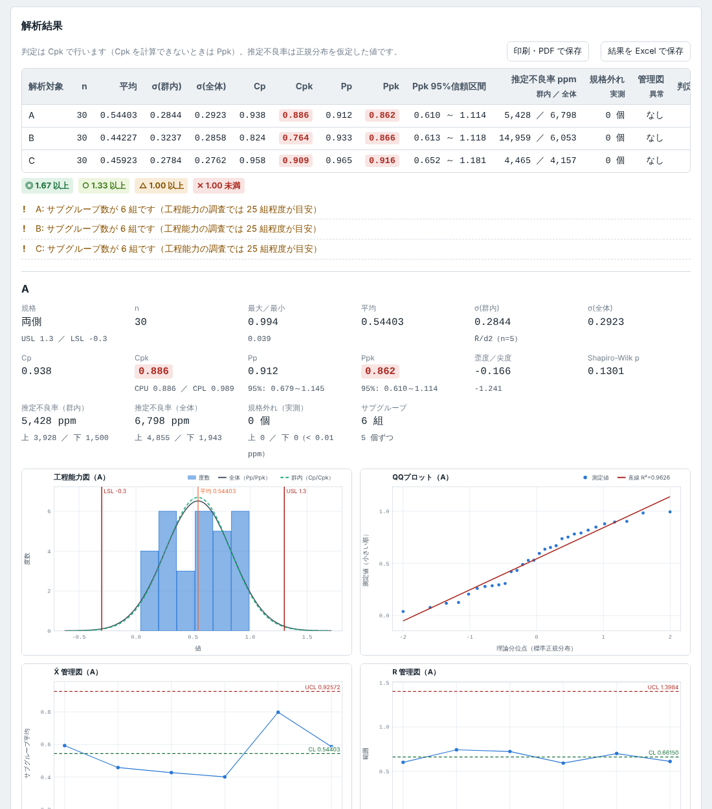
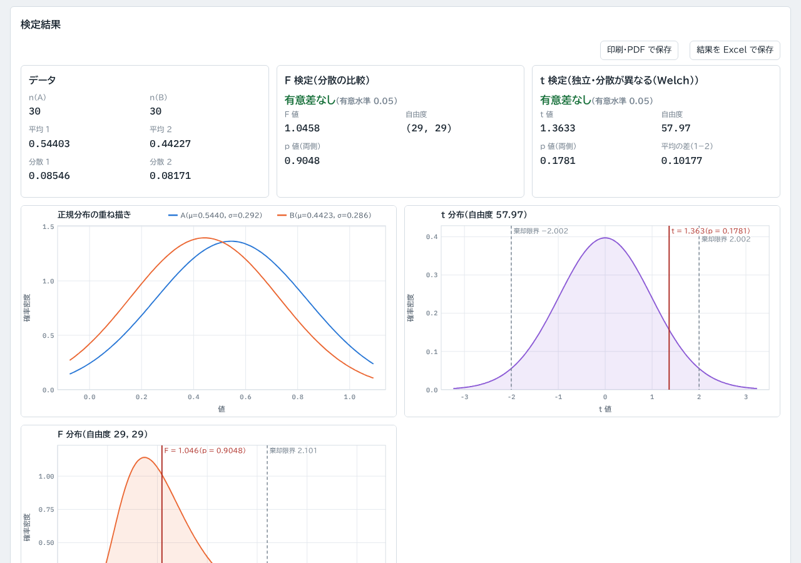

# 工程能力解析（cpk-calc）

Excel の測定データから **Cp・Cpk・Pp・Ppk**、管理図、ヒストグラムなどを計算する Web ツールです。2群の **F検定・t検定・相関** にも対応しています。

**https://kotaooka.github.io/cpk-calc/**

インストールは不要で、ブラウザで開くだけで使えます。

- **データは外に出ません**。ファイルの読み込みと計算はすべてブラウザの中で行い、どこにも送信しません
- 一度開けば**オフラインでも動きます**。スマートフォンやPCにアプリとして追加することもできます

---

## できること

### 工程能力解析

1. **データを読み込む**：Excel（.xlsx）か CSV をドラッグするか選択します。**Excel でコピーした範囲をこのページで Ctrl+V しても読み込めます**。「サンプルデータで試す」で動作を確認できます
2. **解析対象と規格値を入れる**：列（または行）を選び、規格上限値・下限値を入れます。片側規格は使わない側を空欄にします。シートに「USL」「LSL」（「規格上限」「規格下限」など）という名前の行があれば、規格値として自動で入ります
3. **解析する**：結果の一覧と、対象ごとの統計量・グラフが表示されます

| 出力 | 内容 |
|---|---|
| 工程能力指数 | Cp・Cpk（群内変動）、Pp・Ppk（全体変動）、CPU・CPL、Pp・Ppk の 95% 信頼区間 |
| 不良率 | 推定不良率 ppm（群内・全体、上側・下側）、実際に規格を外れた個数 |
| 統計量 | n、最大・最小、平均、σ(群内)、σ(全体)、歪度、尖度、Shapiro-Wilk 検定の p 値 |
| グラフ | 工程能力図（ヒストグラム＋群内・全体の分布曲線＋規格線）、QQプロット、確率密度分布、X̄-R・s 管理図、I-MR 管理図 |
| 管理図の判定 | JIS Z 9020-2 の 8 つの異常判定ルール（当たった点と範囲を表示） |
| 保存 | 結果の Excel ファイル（工程能力・ログ・条件の3シート）、印刷・PDF（対象ごとに1ページ）、グラフの PNG、設定の JSON |

- **サブグループ**は「連続する n 個ずつ」のほか、**ロット番号や日付の列の値で分ける**こともできます。サイズが揃わなくても計算でき、管理限界はサブグループごとのサイズで変わります
- **判定**は Cpk・Ppk・Ppk の 95% 信頼区間の下限から選べ、基準値（初期値 ◎ 1.67 ／ ○ 1.33 ／ △ 1.00）も変えられます

### 2群の検定・相関

2つの列（または行）を選んで、F検定（分散の比較）、t検定（対応あり／独立・等分散／Welch）、相関係数・回帰直線を計算します。t 分布・F 分布の図、正規分布の重ね描き、散布図も出せます。

---

## 計算の定義

- **Cp・Cpk** は群内変動 σ(群内) で計算します。サブグループサイズ 2 以上は R̄/d2、1 は MR̄/d2（d2 = 1.128）です
- **Pp・Ppk** は全データの標準偏差 s で計算します
- 片側規格では Cp・Pp は計算せず、Cpk・Ppk に規格がある側の値（CPU・CPL）を表示します
- σ(群内) は**データが測定（生産）順に並んでいる前提**で求めます。並び順に意味がないデータでは Pp・Ppk を見てください

定義は AIAG SPC マニュアルに合わせています。詳しくはツールの「解説」タブを見てください。

---

## 使うときの注意

- **旧形式の .xls は読めません**。Excel で .xlsx に保存し直してください
- 読み込むのは各シートのセルの値です。数式は Excel が保存した計算結果を使います。日付は Excel の内部の数値（シリアル値）のまま扱います
- CSV は UTF-8 と Shift_JIS に対応しています
- 計算結果は判断材料としてお使いください

---

## 計算の検証

統計計算は外部ライブラリを使わずに実装し、scipy・pandas の値と照合するテストを付けています（push のたびに GitHub Actions で実行）。

- 正規分布・t 分布・F 分布・カイ二乗分布の確率と分位点、Shapiro-Wilk 検定、歪度・尖度、F検定・t検定（3種）・相関
- 工程能力指数（サブグループサイズ 1〜10 × 両側・上側・下側 × 標準偏差の計算方法）
- 管理図の係数 d2 を数値積分で求め直して照合
- Excel の読み込み（openpyxl で読んだ値との全セル照合）と書き出し（openpyxl で読めることを確認）

開発者向けの情報は [DEVELOPMENT.md](DEVELOPMENT.md) にあります。

## ライセンス

[MIT License](LICENSE)
